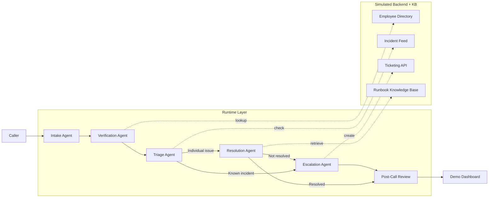
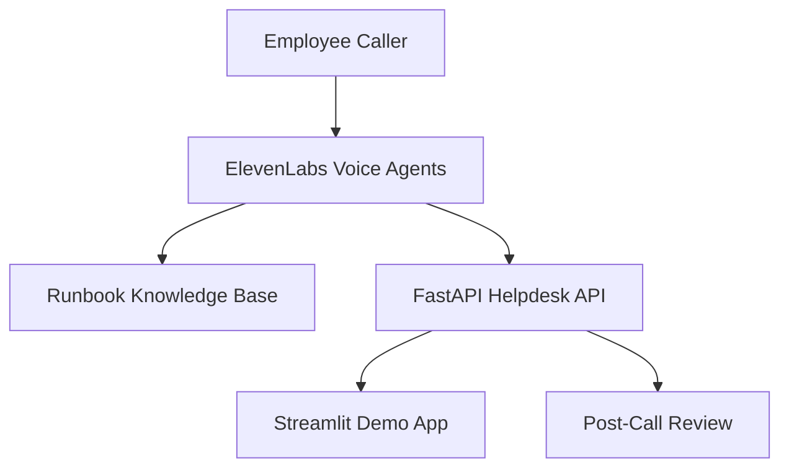

# Multi-Agent IT Support Voice Demo

This demo shows a multi-agent employee IT support flow:

- intake
- verification
- triage
- resolution
- escalation
- post-call review

ElevenLabs Conversational AI fits as the real-time voice layer. This repo provides:

- a simulated helpdesk backend
- a structured call-state engine
- a Streamlit demo dashboard
- a small set of IT runbooks
- API endpoints that ElevenLabs webhook tools can call
- optional Nebius-powered summarization, routing support, QA review, and escalation drafting

## Evaluation

This repo now includes a LangSmith-backed evaluation setup for the Week 3 intake orchestrator.

Artifacts:

- `docs/intake_routing_golden_dataset.xlsx`
- `docs/evaluation.md`
- LangSmith dataset: `intake-routing-golden-v1`
- LangSmith project: `multi-agent-it-support-intake-eval`
- Eval runner: `scripts/langsmith_baseline.py`

Current baseline metrics:

- route accuracy
- intake hold safety
- p50 latency
- token usage
- estimated cost

Run the baseline eval:

```bash
py scripts/langsmith_baseline.py --mode llm
```

Use `--mode heuristic` only for smoke testing the wiring.

See `docs/evaluation.md` for the current baseline snapshot and rerun instructions.

## Run locally

Install dependencies:

```bash
pip install -r requirements.txt
```

Start the simulated helpdesk API:

```bash
uvicorn api:app --reload
```

Start the demo UI:

```bash
streamlit run app.py
```

Create a local `.env` file from the example template, then fill in your keys:

```bash
copy .env.example .env
```

Edit `.env` and add values like:

```env
ELEVENLABS_API_KEY=your_elevenlabs_key
ELEVENLABS_AGENT_ID=your_elevenlabs_agent_id
ELEVENLABS_WEBHOOK_URL=https://your-public-url/webhooks/elevenlabs/post-call
ELEVENLABS_WEB_VOICE_URL=https://your-live-elevenlabs-browser-session-url

NEBIUS_API_KEY=your_nebius_key
NEBIUS_MODEL=your_nebius_model
NEBIUS_BASE_URL=https://api.tokenfactory.nebius.com/v1
```

The app automatically loads `.env` when Streamlit and the API start, so you do not need to enter those values in the UI.

## ElevenLabs setup

Set these environment variables before running the app:

- `ELEVENLABS_API_KEY`
- `ELEVENLABS_AGENT_ID`
- `ELEVENLABS_WEBHOOK_URL`
- `ELEVENLABS_WEB_VOICE_URL`

Use the FastAPI endpoints as webhook targets for ElevenLabs tools:

- `POST /employees/verify`
- `GET /incidents/{category}`
- `POST /tickets`
- `POST /webhooks/elevenlabs/post-call`

Upload the runbooks in `runbooks/` to the ElevenLabs knowledge base, then enable RAG on the agent.

For the live voice flow, create an ElevenLabs agent that:

- handles intake
- calls the verification and ticket tools
- uses the knowledge base for troubleshooting
- transfers to escalation when needed

Use this intake agent prompt pattern so it does not transfer too early:

```text
You are the Intake Orchestrator for employee IT support.

Goals:
- Greet the employee warmly.
- Ask the employee to describe the issue in their own words.
- Do not transfer immediately after the greeting.
- Do not hand off until the employee has clearly stated their issue.
- Ask at most one clarifying question if the issue is still ambiguous.
- Only route to verification or triage after you have enough detail to identify the support path.
- If the caller describes a known incident, route to escalation.
- If the issue appears to be an individual problem, continue through verification and troubleshooting.
- If the employee has not stated a problem yet, stay in intake and continue the conversation.
- Do not make a routing decision based only on the greeting.
- Do not infer the issue from the employee identity alone.
- Wait for an explicit problem statement before any handoff.

Style:
- Be concise, calm, and professional.
- Do not skip the intake step.
- Do not hand off during the greeting turn.
- Do not infer the problem before the employee speaks.
```

Routing guard to configure in ElevenLabs:

- If the agent has not heard a clear issue statement, it must remain in intake.
- If the agent only knows the employee name or greeting, it must ask a follow-up question instead of transferring.
- If you are using a workflow or procedure, make the transfer step conditional on captured issue text, not on the first assistant turn.
- Remove any automatic transfer rule that fires on the greeting alone.

If the agent still transfers too early, the cause is almost certainly the agent workflow or transfer condition in ElevenLabs, not this repo.

Set `ELEVENLABS_WEB_VOICE_URL` to the live browser session URL from ElevenLabs. The Streamlit app will show a launch panel for that session. ElevenLabs blocks iframe embedding for this page, so the live voice experience opens in a new tab instead of inside the Streamlit frame.

The Streamlit app reads the ElevenLabs settings from the environment and shows them in the sidebar as read-only status. It remains the presentation layer for the demo and the post-call review.

## Nebius setup

If you want backend AI assistance for routing, call summaries, QA review, and escalation drafting, set:

- `NEBIUS_API_KEY`
- `NEBIUS_MODEL`
- `NEBIUS_BASE_URL`

When those are present, the backend will use Nebius for:

- transcript summarization
- routing support
- QA review
- escalation drafting

If the Nebius settings are empty, the app falls back to deterministic local logic.

## Call Flow



At a glance:

- The caller enters through the voice experience.
- Intake, verification, triage, resolution, and escalation are the active agents.
- The post-call review stage produces the QA summary.
- The demo dashboard shows the transcript, handoffs, and review outcome.

## Architecture



This is the simplest way to think about the system:

- ElevenLabs runs the live conversation and agent handoffs.
- The FastAPI app simulates the helpdesk systems and receives the post-call webhook.
- The Streamlit app presents the live demo and structured review.
- The API endpoints behind the diagram are `POST /employees/verify`, `GET /incidents/{category}`, `POST /tickets`, and `POST /webhooks/elevenlabs/post-call`.
