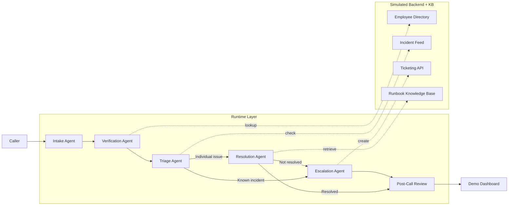

# Multi-Agent IT Support Voice Demo

This demo shows a multi-agent employee IT support flow:

- intake
- verification
- triage
- resolution
- escalation
- post-call review

ElevenLabs Conversational AI fits as the real-time voice layer. This repo provides:

- a simulated helpdesk backend
- a structured call-state engine
- a Streamlit demo dashboard
- a small set of IT runbooks
- API endpoints that ElevenLabs webhook tools can call

## Run locally

Install dependencies:

```bash
pip install -r requirements.txt
```

Start the simulated helpdesk API:

```bash
uvicorn api:app --reload
```

Start the demo UI:

```bash
streamlit run app.py
```

## ElevenLabs setup

Use the FastAPI endpoints as webhook targets for ElevenLabs tools:

- `POST /employees/verify`
- `GET /incidents/{category}`
- `POST /tickets`
- `POST /webhooks/elevenlabs/post-call`

Upload the runbooks in `runbooks/` to the ElevenLabs knowledge base, then enable RAG on the agent.

For the live voice flow, create an ElevenLabs agent that:

- handles intake
- calls the verification and ticket tools
- uses the knowledge base for troubleshooting
- transfers to escalation when needed

The Streamlit app is the presentation layer for the demo and the post-call review.

## Call Flow



At a glance:

- The caller enters through the voice experience.
- Intake, verification, triage, resolution, and escalation are the active agents.
- The post-call review stage produces the QA summary.
- The demo dashboard shows the transcript, handoffs, and review outcome.

## Architecture

```mermaid
flowchart TB
    Caller[Employee Caller]

    subgraph EL[ElevenLabs Voice Layer]
      A[Intake Orchestrator]
      B[Verification Agent]
      C[Resolution Agent]
      D[Escalation Agent]
      KB[Runbook Knowledge Base]
    end

    subgraph API[Simulated Helpdesk API]
      V[/employees/verify/]
      I[/incidents/{category}/]
      T[/tickets/]
      P[/webhooks/elevenlabs/post-call/]
    end

    subgraph UI[Demo App]
      S[Streamlit Dashboard]
      R[Post-Call Review Panel]
    end

    Caller --> A
    A --> B
    B --> C
    C --> D
    C -. knowledge lookup .-> KB
    B -. verify .-> V
    C -. incident lookup .-> I
    D -. create ticket .-> T
    P --> R
    API --> S
    A -. transcript/state .-> P
```

This is the simplest way to think about the system:

- ElevenLabs runs the live conversation and agent handoffs.
- The FastAPI app simulates the helpdesk systems and receives the post-call webhook.
- The Streamlit app presents the live demo and structured review.
